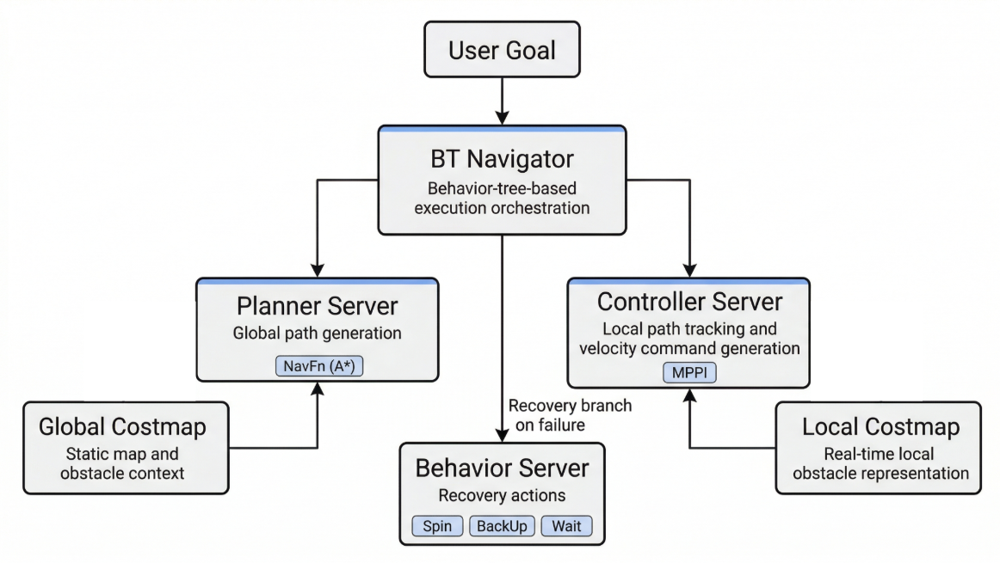

import { Steps } from '@astrojs/starlight/components';

AntBot은 ROS 2의 공식 네비게이션 프레임워크인 Nav2를 연동하여 자율주행을 수행할 수 있습니다.
시뮬레이션에서 실행하려면 [5.3 시뮬레이션 환경 구축](/antbot/development-guide/simulation/)이 완료된 상태여야 합니다.



---

## 의존성 설치

```bash
sudo apt install ros-humble-navigation2 ros-humble-nav2-bringup \
  ros-humble-slam-toolbox ros-humble-robot-localization \
  ros-humble-nav2-mppi-controller
```

---

## 빌드

```bash
cd ~/ros2_ws
colcon build --symlink-install --packages-up-to antbot_navigation
source install/setup.bash
```

---

## Launch 종류

| Launch 파일 | 용도 | 특징 |
|-------------|------|------|
| `navigation.launch.py` | 저장된 맵으로 자율주행 | AMCL + Nav2 전체 스택 |
| `slam.launch.py` | 맵 생성과 동시에 네비게이션 | SLAM Toolbox (사전 맵 불필요) |
| `localization.launch.py` | 위치 추정 전용 | 경로 계획 없음 |

모든 launch 파일은 `mode` 인자로 시뮬레이션과 실제 로봇을 전환합니다:

```bash
ros2 launch antbot_navigation slam.launch.py mode:=sim    # 시뮬레이션
ros2 launch antbot_navigation slam.launch.py mode:=real   # 실제 로봇
```

---

## 시뮬레이션 모드

### 실행

<Steps>

1. **Gazebo 시뮬레이션 실행**

   ```bash
   # Terminal 1
   ros2 launch antbot_gazebo gazebo.launch.py world:=depot
   ```

2. **Nav2 네비게이션 실행**

   ```bash
   # Terminal 2
   ros2 launch antbot_navigation navigation.launch.py mode:=sim world:=depot
   ```

3. **RViz 시각화**

   ```bash
   # Terminal 3
   rviz2 -d $(ros2 pkg prefix antbot_navigation --share)/rviz/navigation.rviz \
     --ros-args -p use_sim_time:=true
   ```

</Steps>

### 맵 저장

SLAM 모드에서 생성한 맵을 파일로 저장합니다:

```bash
ros2 run nav2_map_server map_saver_cli -f ~/maps/my_map
```

저장된 맵으로 자율주행하려면:

```bash
ros2 launch antbot_navigation navigation.launch.py mode:=sim \
  map:=/path/to/my_map.yaml
```

---

## 실제 로봇 모드

:::note
이 섹션은 추후 업데이트 예정입니다.
:::

### 실행

<Steps>

1. **AntBot bringup 실행**

   ```bash
   # Terminal 1
   ros2 launch antbot_bringup bringup.launch.py
   ```

2. **Nav2 네비게이션 실행**

   ```bash
   # Terminal 2
   ros2 launch antbot_navigation navigation.launch.py mode:=real
   ```

3. **RViz 시각화**

   ```bash
   # Terminal 3
   rviz2 -d $(ros2 pkg prefix antbot_navigation --share)/rviz/navigation.rviz
   ```

</Steps>

### 맵 저장

SLAM 모드에서 생성한 맵을 파일로 저장합니다:

```bash
ros2 run nav2_map_server map_saver_cli -f ~/maps/my_map
```

저장된 맵으로 자율주행하려면:

```bash
ros2 launch antbot_navigation navigation.launch.py mode:=real \
  map:=/path/to/my_map.yaml
```

---

## 네비게이션 목표 지점 설정

**단일 목표 지점**

<Steps>

1. RViz에서 **2D Pose Estimate**를 클릭하여 초기 위치를 설정합니다

2. **Nav2 Goal**을 클릭하여 목표 지점을 지정합니다

</Steps>

**다중 웨이포인트 순회**

<Steps>

1. RViz 실행

2. Panels → **Add New Panel** → `nav2_rviz_plugins/Navigation2` 선택

3. **Waypoint Mode** 체크 후 맵에서 여러 목표 지점 클릭

4. **Start Waypoint Following** 클릭

</Steps>

**CLI를 통한 목표 설정**

```bash
# map 프레임 기준 좌표 (x: 5.0, y: 3.0)로 목표 전송
ros2 action send_goal /navigate_to_pose nav2_msgs/action/NavigateToPose \
  "{pose: {header: {frame_id: 'map'}, pose: {position: {x: 5.0, y: 3.0}}}}"
```

---

:::tip[더 알아보기]
- 파라미터 튜닝, TF 구조, 트러블슈팅 → [antbot_navigation README](https://github.com/ROBOTIS-move/antbot/tree/main/antbot_navigation)
:::
