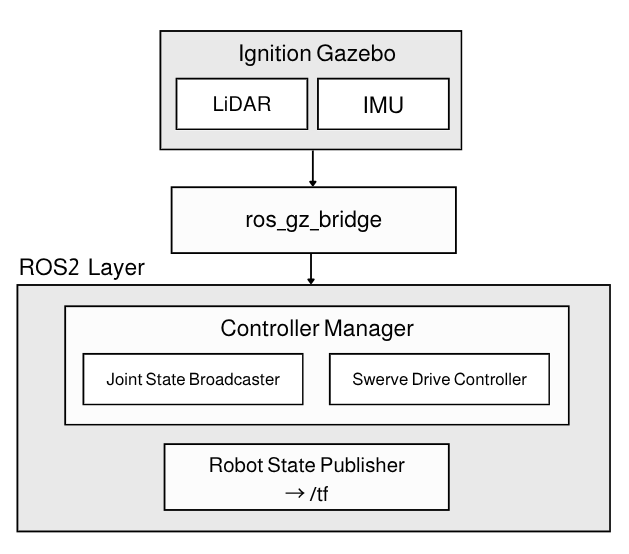

import { Steps } from '@astrojs/starlight/components';

AntBot은 Ignition Gazebo(Fortress)에서 실물 하드웨어 없이 스워브 드라이브 로봇을 구동하고 테스트할 수 있습니다.



---

## 의존성 설치

```bash
sudo apt install ros-humble-ros-gz ros-humble-ign-ros2-control \
  ros-humble-xacro ros-humble-robot-state-publisher
```

---

## 빌드

```bash
cd ~/ros2_ws
colcon build --symlink-install --packages-up-to antbot_gazebo
source install/setup.bash
```

---

## 실행

<Steps>

1. **Gazebo 시뮬레이션 실행**

   ```bash
   # Terminal 1
   ros2 launch antbot_gazebo gazebo.launch.py
   ```

2. **키보드로 로봇 제어**

   ```bash
   # Terminal 2
   ros2 run antbot_teleop teleop_keyboard
   ```

</Steps>

---

## 월드 변경

기본값은 빈 월드(`empty`)입니다. `world` 인자로 다른 월드를 지정할 수 있습니다:

```bash
# worlds.yaml에 등록된 이름으로 실행
ros2 launch antbot_gazebo gazebo.launch.py world:=depot

# SDF 파일 경로로 직접 실행
ros2 launch antbot_gazebo gazebo.launch.py world:=/path/to/world.sdf
```

---

:::tip[더 알아보기]
- URDF 구조, 센서, 컨트롤러, 커스텀 월드 등 상세 설정 → [antbot_gazebo README](https://github.com/ROBOTIS-move/antbot/tree/main/antbot_gazebo)
- Nav2 자율주행 연동 → [5.4 Nav2 연동](/antbot/development-guide/navigation/)
:::
