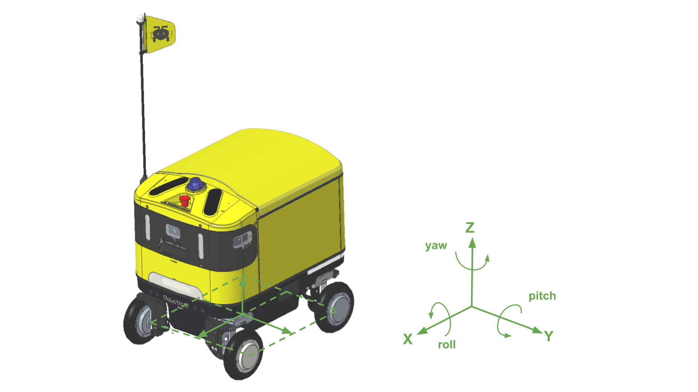

## 주요 센서 구성

| 센서 | 수량 | 연결 | 비고 |
| :--- | :---: | :--- | :--- |
| 3D LiDAR | 1 | Ethernet | 360° 3D 포인트 클라우드 |
| 2D LiDAR | 2 | USB | 전방 + 후방 장애물 감지 |
| RGB-D 카메라 | 1 | USB | Color + Depth |
| 모노 카메라 | 4 | V4L2 | 전방 3 + 후방 1 |
| IMU | 1 | USB | 6축 (가속도 + 자이로) |
| GNSS | 1 | USB | GPS 수신기 |

---

## 센서 좌표

AntBot 주요 센서의 `base_link` 기준 위치와 자세입니다.<br />
아래 표는 URDF 기본값이며, 로봇별 측정값은 센서 캘리브레이션 항목을 참고하세요.

- 위치: `mm`
- 각도: `degree`



### 카메라

| 센서 | 위치 | X | Y | Z | Roll | Pitch | Yaw |
| :--- | :--- | ---: | ---: | ---: | ---: | ---: | ---: |
| 모노 카메라 | LEFT | 260.000 | 254.770 | 587.500 | 0 | 0 | 90 |
| 모노 카메라 | CENTER | 358.070 | 0 | 587.500 | 0 | 0 | 0 |
| 모노 카메라 | RIGHT | 260.000 | -254.770 | 587.500 | 0 | 0 | -90 |
| 모노 카메라 | BACK | -376.690 | 0 | 299.000 | 0 | 0 | 180 |
| RGB-D 카메라 | CENTER | 348.162 | 47.500 | 526.484 | 0 | 30 | 0 |

### LiDAR

| 센서 | 위치 | X | Y | Z | Roll | Pitch | Yaw |
| :--- | :--- | ---: | ---: | ---: | ---: | ---: | ---: |
| 2D LiDAR | FRONT | 325.000 | 0 | 255.000 | 0 | 180 | 0 |
| 2D LiDAR | BACK | -325.000 | 0 | 255.000 | 180 | 0 | 0 |
| 3D LiDAR | FRONT | 225.332 | 0 | 724.904 | 0 | 10 | 0 |

### 기타 센서

| 센서 | X | Y | Z | Roll | Pitch | Yaw |
| :--- | ---: | ---: | ---: | ---: | ---: | ---: |
| IMU | 240.000 | 6.75 | 390.200 | 0 | 0 | 180 |
| GNSS | 202.600 | -128.000 | 660.000 | 0 | 0 | 180 |

:::note
URDF에서 이 좌표를 확인하려면 [`antbot_description/urdf/antbot.xacro`](https://github.com/ROBOTIS-move/antbot/blob/main/antbot_description/urdf/antbot.xacro)를 참조하세요.<br />
각 센서의 ROS 토픽은 [주요 ROS 토픽/서비스](/antbot/development-guide/ros-topics/)에서 확인할 수 있습니다.
:::

---

## 센서 캘리브레이션

### 적용 방식

로봇 생산 시 측정한 로봇별 센서 외부 파라미터(extrinsic) 캘리브레이션 데이터입니다.<br />
파일이나 센서 항목이 없으면 해당 센서의 URDF 기본값을 사용합니다.

- **파일**: `~/ANTBOT/calibration.yaml`
- **좌표 기준**: `base_link` 기준 센서 위치·자세
- **적용**: `antbot_bringup` 실행 시 URDF 기본 좌표를 대체하여 센서 TF에 반영

| 필드 | 의미 | 단위 |
| :--- | :--- | :--- |
| `tx`, `ty`, `tz` | X, Y, Z 위치 | 미터 (`m`) |
| `rx`, `ry`, `rz` | Roll, Pitch, Yaw | 라디안 (`rad`) |

### 파일 구성 예시

| 키 | 대상 센서 | TF 프레임 |
| :--- | :--- | :--- |
| `camera_front_extrinsic` | 전방 모노 카메라 | `camera_mono_front_link` |
| `camera_left_extrinsic` | 좌측 모노 카메라 | `camera_mono_left_link` |
| `camera_right_extrinsic` | 우측 모노 카메라 | `camera_mono_right_link` |
| `lidar_2d_back_extrinsic` | 후방 2D LiDAR | `lidar_2d_back_link` |
| `lidar_2d_front_extrinsic` | 전방 2D LiDAR | `lidar_2d_front_link` |

```yaml
camera_front_extrinsic:
  rx: 0.0004841534918956223
  ry: -0.022696397032526777
  rz: -0.024963586218731022
  tx: 0.3713665035809988
  ty: -0.0012114368184327506
  tz: 0.5819776834826769
camera_left_extrinsic:
  rx: -8.26610835375321e-05
  ry: 0.010437505309254372
  rz: 1.5477847272499485
  tx: 0.264771522661827
  ty: 0.2624195508373959
  tz: 0.5786230512170198
camera_right_extrinsic:
  rx: 0.005940643853633356
  ry: 0.017139707082721167
  rz: -1.5984502045959927
  tx: 0.26360728011109097
  ty: -0.2633683883510877
  tz: 0.5732517098202605

lidar_2d_back_extrinsic:
  rx: 3.141592653589793
  ry: 0.0
  rz: -0.018807469931779952
  tx: -0.325
  ty: 0.0
  tz: 0.255
lidar_2d_front_extrinsic:
  rx: 0.0
  ry: 3.141592653589793
  rz: -0.15944110598522698
  tx: 0.325
  ty: 0.0
  tz: 0.255
```
