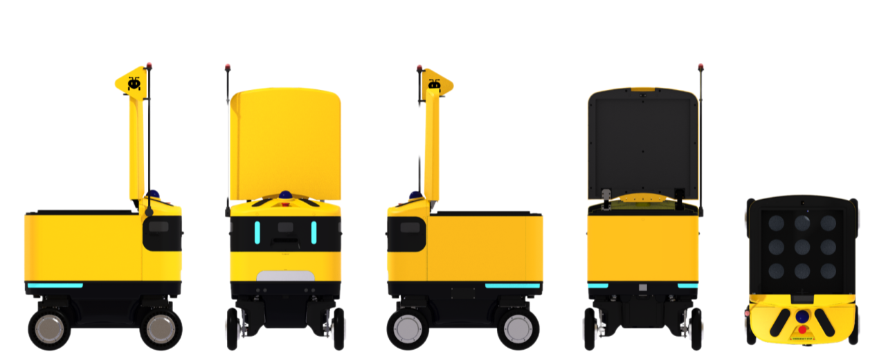

자율주행 배송 로봇 · ROBOTIS AI · 오픈소스

**AntBot**은 ROBOTIS AI에서 개발한 오픈소스 자율주행 배송 로봇입니다.

## 전제

**좋은 로봇은 어디든 갈 수 있어야 합니다. 좋은 기술은 누구나 쓸 수 있어야 합니다.** AntBot의 모든 설계 결정은 이 두 문장에서 비롯됩니다. 센서 하나의 배치, 바퀴 구동 방식의 선택, 소프트웨어 공개 범위까지. 두 전제에 부합하지 않으면 채택하지 않았습니다.

## 라스트마일

물류의 마지막 구간은 가장 짧고 가장 까다롭습니다. 캠퍼스 보도, 아파트 단지, 지하 주차장. 좁은 골목, 연석, 경사로, 예측할 수 없는 보행자. 차선이 없고, 신호가 없고, 정해진 경로가 없습니다.

이 환경에서 로봇에게 요구되는 조건은 하나입니다. 어디로든. 어느 방향으로든. 지금 즉시. AntBot의 하드웨어 설계는 이 한 문장을 구현하기 위해 존재합니다.

## 스워브 드라이브

AntBot은 네 개의 바퀴가 각각 독립적으로 조향하는 스워브 드라이브를 채택했습니다. 전방향 이동, 제자리 회전, 횡이동이 가능합니다. 차동 구동 로봇이 여러 번의 전후진으로 빠져나와야 하는 상황을, 스워브 드라이브는 한 번의 동작으로 통과합니다.

라스트마일이 만들어내는 예외를 개별적으로 처리하지 않습니다. 막다른 골목, 갑작스러운 장애물, 비좁은 엘리베이터 앞. 하나의 구동 방식이 모든 예외를 수용합니다.

## 센서 아키텍처

어디든 가려면 모든 것을 볼 수 있어야 합니다. AntBot의 센서 구성은 이 요구를 빈틈 없이 채우기 위해 설계되었습니다.

360도 전방위를 감싸는 3D LiDAR가 공간 구조를 잡습니다. 전방과 후방에 배치된 2D LiDAR 두 기가 지면 근처의 장애물, 연석이나 화분, 낮은 기둥 같은 것들을 감지합니다. RGB-D 카메라가 깊이 정보를 더해 물체의 거리와 형태를 동시에 읽고, 네 대의 모노 카메라가 나머지 사각지대를 채웁니다.

각 센서는 서로의 한계를 보완합니다. LiDAR가 놓치는 텍스처를 카메라가 채우고, 카메라가 약한 저조도 환경을 LiDAR의 능동 센싱이 덮습니다. 이는 개별 센서의 조합이 아닌, 하나의 인지 체계입니다.

## 오픈소스

기술은 닫혀 있을 때 완성되지 않습니다. AntBot은 제어기부터 센서 드라이버, 네비게이션 스택까지 전체 소프트웨어를 공개합니다.

실외 자율주행이 만들어내는 엣지 케이스는 끝이 없습니다. 젖은 맨홀 뚜껑, 배수구 격자, 야간의 역광. 이 도전들에 대한 해법은 회의실에서 발견되지 않습니다. 로봇이 실제로 굴러가는 곳에서, 그 로봇을 매일 마주하는 사람들의 손에서 나옵니다.

우리는 한 팀의 능력보다 공동체의 경험을 신뢰합니다. 코드를 공개하는 것은 그 경험에 합류하겠다는 약속이자, 동시에 초대입니다.

이 문서는 AntBot의 하드웨어 구성, 소프트웨어 아키텍처, 그리고 각 설계 결정의 근거를 다룹니다. 세부 사양과 구현 방법은 이후 섹션에서 확인할 수 있습니다.
